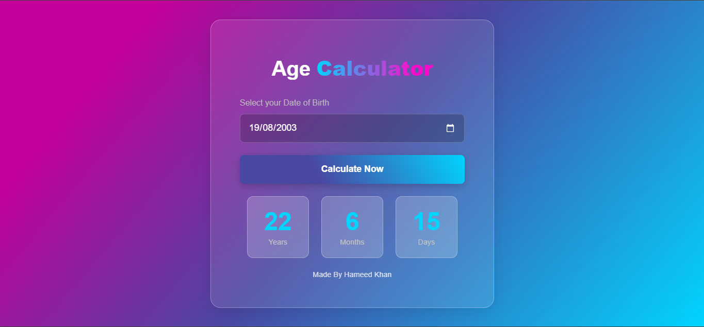

# Age Calculator

A simple, beautiful web app that calculates your exact age in years, months, and days.

- Live Demo: [Age Calculator Live Demo]()

---

## Screenshot

## Features

- **Exact Age Calculation** - Get your precise age in years, months, and days
- **Clean UI** - Vibrant gradient background with smooth glass-morphism effects
- **Works Everywhere** - Fully responsive on mobile, tablet, and desktop
- **One Click** - Just select your birth date and hit calculate

---

## Built With

- HTML5
- CSS3
- JavaScript

---

## How to Use

1. Select your date of birth from the calendar picker
2. Click "Calculate Now"
3. View your age in years, months, and days

---

## What I Learned

- DOM manipulation with JavaScript
- Date object and date calculations
- CSS gradients and glassmorphism
- Making responsive layouts with media queries
- Frame Animation: Counting Animation (Most importantly)

---

## About Me

**Hameed Khan** - Aspiring web developer learning and building cool stuff.

[GitHub](https://github.com/hameed-codes) | [LinkedIn](https://linkedin.com/in/yourprofile)

---

*Made with Love and code by Hameed Khan*